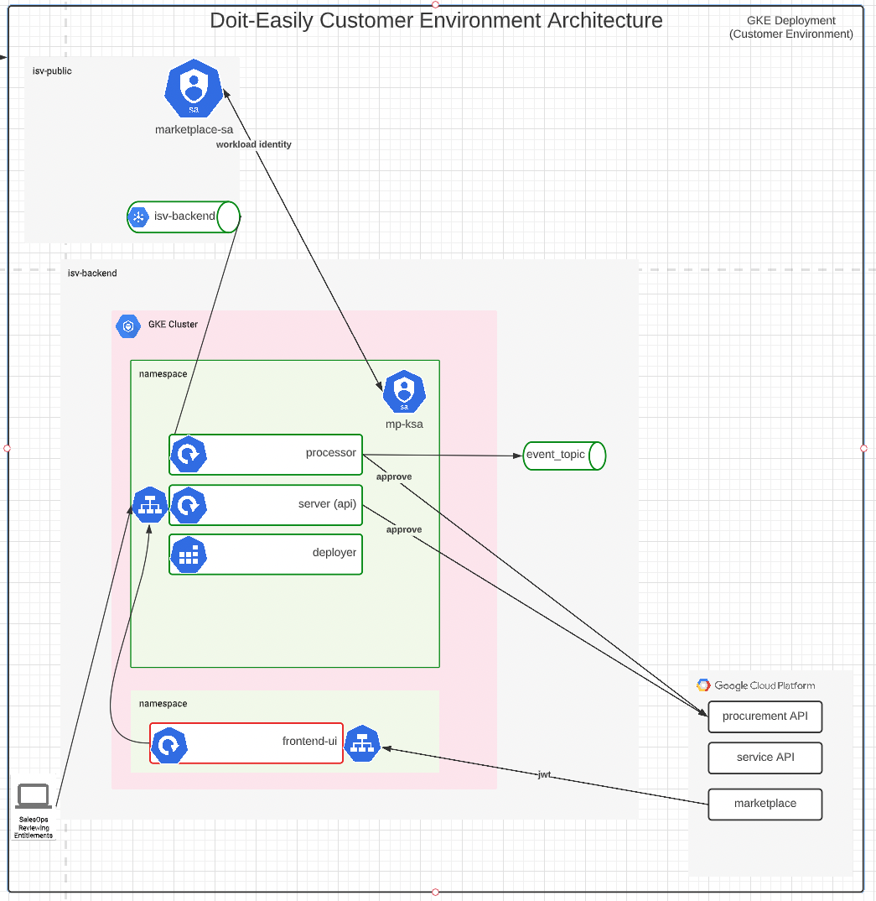

# Overview

Doit-Easily is the [backend integrations][1] required for a GCP marketplace Saas Offering.

This backend integration is designed to be deployed into an existing GKE cluster. It offers Slack notifications and
simple pubsub events to indicate events (create, update, destroy). It also provides an API to front
the Procurement API, handling all required auth and configuration to work with the Procurement API. This allows you
to create a simple UI to view and approve entitlement creation requests, and manually approve them before provisioning
services for new customers. Optionally you can also auto approve entitlements (skipping manual approval).

Doit-Easily will also work to satisfy the requirements of the [Saas-Codelab][3].

# Architecture

# Components not included
- Frontend Integration: we include a simple example, but only to showcase how to do this (TODO) 
- Backend Integration UI: this solution DOES give a simple API which fronts the procurement API, but no UI is provided beyond the simplest example. (TODO) 
- Ingress/Auth: because this solution will be deployed into an existing GKE cluster, we don't know how you might expose
your services to end users. As such, the default installation of this product leaves a ClusterIP service for you to expose
as you see fit. We will expose using IAP/Ingress in the future (TODO)

#Installation

## Prerequisites
- Steps 1 & 2 from [this checklist][2] should be completed first.
- Create service Account with access to Procurement API & Marketplace Topic 
  - [example create script for using SAAS-Codelab][6]
  - Docs how to create [via producer portal][9]
- Create pull subscription on the procurement topic 
  - Documented [here][8]
  - [example create script][7]
- Create A GKE cluster (or use existing)
  - workload identity enabled
  - Full access to API scopes
  - [example create script][5]

## Optional Prerequisites
- Create Topic for publishing events 
  - [example create script][5]
- Create a Slack webhook URL for publishing notifications (see slack docs)

## Deploy with MPDEV
See [docs][10]

# local setup
Set it up in a cluster in gcp, easier to run as the SA (rather than suggesting DLing the json key and all that)
Deploy it with `IS_CODELAB=true` to run in codelab mode

## Application CRD 
If you cluster doesn't have the Application CRD, you'll need it. [Install the Application CRD][4] into the cluster  
`kubectl apply -f https://raw.githubusercontent.com/kubernetes-sigs/application/master/deploy/kube-app-manager-aio.yaml`

[1]: https://cloud.google.com/marketplace/docs/partners/integrated-saas/backend-integration
[2]: https://cloud.google.com/marketplace/docs/partners/integrated-saas#checklist
[3]: https://codelabs.developers.google.com/codelabs/gcp-marketplace-integrated-saas/#0
[4]: https://cloud.google.com/solutions/using-gke-applications-page-cloud-console#preparing_gke
[5]: ./required-infra/create-isv-backend-infra-3.sh
[6]: ./required-infra/create-isv-public-infra-1.sh
[7]: ./required-infra/create-isv-public-infra-2.sh
[8]:https://cloud.google.com/marketplace/docs/partners/integrated-saas/technical-integration-setup
[9]: https://cloud.google.com/marketplace/docs/partners/integrated-saas/backend-integration#producer-portal-service-accounts
[10]: ./docs/install-mpdev.md